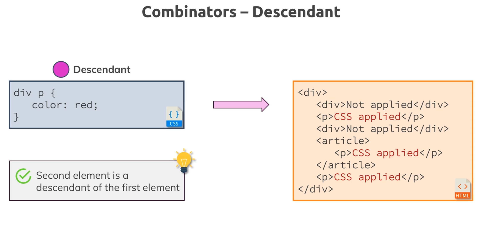
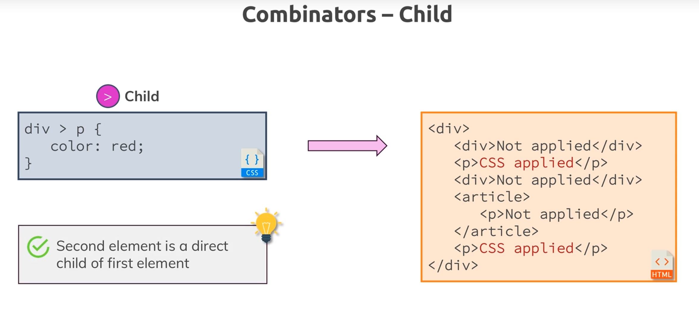
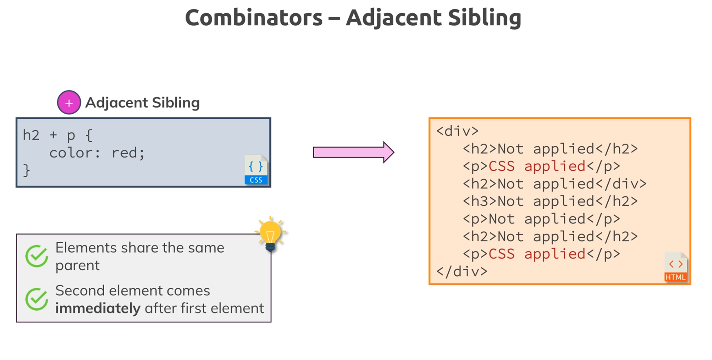
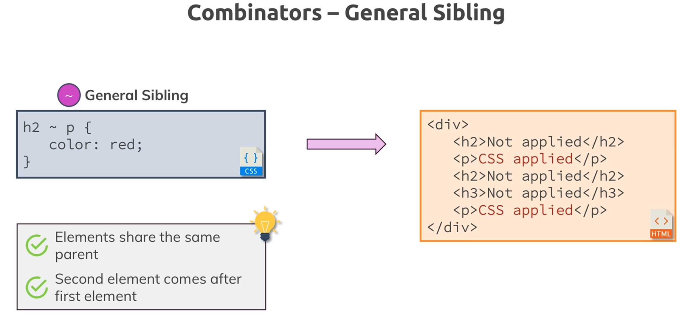
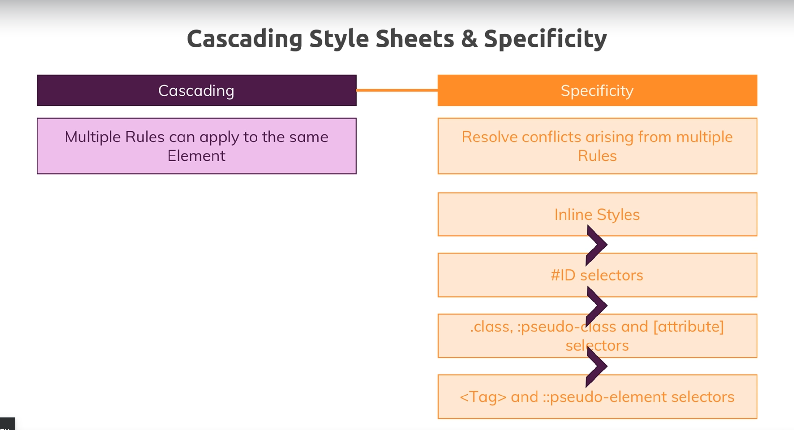

## CSS Basics

### 1. Selectors:

CSS selectors are patterns used to select the elements you want to style in a web page. They allow you to target HTML elements and apply styles to them. CSS selectors are powerful tools that enable you to target specific HTML elements precisely and apply styles accordingly. Here are the main types of CSS selectors:

#### Type Selector

Selects all elements of a given type.

```css
p {
    color: blue;
}
```

This will apply the style to all `<p>` elements.

#### Class Selector

Selects all elements with a specific class attribute. Prefixed with a dot `.`.

```css
.className {
    color: red;
}
```

This will apply the style to all elements with class="className".

#### ID Selector

Selects a single element with a specific id attribute. Prefixed with a hash `#`.

```css
#idName {
    color: green;
}
```

This will apply the style to the element with `id="idName"`.

#### Universal Selector

Selects all elements on the page. Denoted by an asterisk `*`.

```css
* {
    color: black;
}
```

This will apply the style to all elements.

#### Attribute Selector

Selects elements based on the presence or value of a given attribute. The list of attributes can be found [here](https://www.w3schools.com/cssref/index.php).

```css
[type="text"] {
    border: 1px solid black;
}
```

This will apply the style to all elements with `type="text"`.

#### Pseudo-class Selector

Selects elements based on their state or position. The list of pseudo-classes can be found [here](https://developer.mozilla.org/en-US/docs/Web/CSS/Pseudo-classes).

```css
a:hover {
    color: orange;
}
```

This will apply the style to links when they are hovered over.

#### Pseudo-element Selector

Selects and styles a part of an element. For example, it can be used to:

-   Style the first letter, or line, of an element
-   Insert content before, or after, the content of an element

**Note**: The ::first-line pseudo-element can only be applied to block-level elements.

The following properties apply to the `::first-line pseudo-element`:

-   font properties
-   color properties
-   background properties
-   word-spacing
-   letter-spacing
-   text-decoration
-   vertical-align
-   text-transform
-   line-height
-   clear

```css
p::first-line {
    font-weight: bold;
}
```

This will apply the style to the first line of all `<p>` elements.

#### Descendant Selector

Selects elements that are descendants of a specified element.

```css
div p {
    color: purple;
}
```

This will apply the style to all `<p>` elements inside `<div>` elements. Bellow the illustration showing how the Descendant Selector applies the style:



#### Child Selector

Selects elements that are direct children of a specified element.

```css
ul > li {
    color: blue;
}
```

This will apply the style to all `<li>` elements that are direct children of `<ul>` elements. Bellow the illustration showing how the Child Selector applies the style:



#### Adjacent Sibling Selector

Selects an element that is immediately preceded by a specified element.

```css
h1 + p {
    color: brown;
}
```

This will apply the style to the <p> element that immediately follows an `<h1>` element. Illustration below explains how the Adjacent Selector applies the style:



#### General Sibling Selector

Selects all elements that are siblings of a specified element.

```css
h1 ~ p {
    color: pink;
}
```

This will apply the style to all `<p>` elements that are siblings of an `<h1>` element. Illustration below explains how the General Selector applies the style:



#### Compound selector

A compound selector is a sequence of simple selectors that are not separated by a combinator. A compound selector represents a set of simultaneous conditions on a single element. A given element is said to match a compound selector when the element matches all the simple selectors in the compound selector.

```css
a#selected {
}

[type="checkbox"]:checked:focus {
}
```

In a compound selector, the type selector or universal selector must come first in the sequence of selectors. Only one type selector or universal selector is allowed in the sequence. As whitespace represents the descendant combinator, no whitespace is allowed between the simple selectors that make up a compound selector.

#### Selector list

A selector list is a comma-separated list of simple, compound, and/or complex selectors. selects all the matching nodes. A given element is said to match a selector list when the element matches any (at least one) of the selectors in that selector list.

```css
#main,
article.heading {
}
```

### 2. "Cascading" rule

The term "cascading" in CSS refers to the process by which the browser determines which styles to apply to an element when there are multiple competing rules. The "cascade" is a way to resolve conflicts between different style rules and decide the final styles that will be applied. The cascade follows these principles:

1. **Importance**: Styles marked as `!important` will take precedence over other styles.
2. **Specificity**: More specific selectors will override less specific ones.
3. **Source Order**: When selectors have the same specificity, the styles defined later in the CSS will override those defined earlier.

**Example**:

```html
<!DOCTYPE html>
<html lang="en">
    <head>
        <meta charset="UTF-8" />
        <title>CSS Cascading Example</title>
        <style>
            p {
                color: blue;
            }
            .highlight {
                color: red;
            }
            #unique {
                color: green;
            }
            p {
                color: black;
            }
        </style>
    </head>
    <body>
        <p id="unique" class="highlight">This is a paragraph.</p>
    </body>
</html>
```

In this example:

-   The `<p>` element is initially set to blue.
-   The `.highlight` class would change the color to red.
-   The `#unique` ID would change the color to green.
-   The second `<p>` selector sets the color to black.
-   Due to cascading rules, the final color of the paragraph is black because it is the last rule applied with the same specificity.

### 3. Specificity in CSS

Specificity is a weight that is applied to a given CSS declaration to determine how strong it is in influencing the style of an element. It is calculated based on the types of selectors used in the rule.
Specificity Calculation

Specificity is calculated based on four components (often represented as a four-digit number a,b,c,d):

    Inline styles (not selectors, but important to know): a (inline styles) - inline styles have the highest specificity.
    ID selectors: b - ID selectors have high specificity.
    Class selectors, attribute selectors, and pseudo-classes: c - class selectors have medium specificity.
    Type selectors (element selectors) and pseudo-elements: d - type selectors have the lowest specificity.

**Example**:

```css
/* Specificity: 0,0,0,1 */
p {
    color: blue;
}

/* Specificity: 0,0,1,0 */
.highlight {
    color: red;
}

/* Specificity: 0,1,0,0 */
#unique {
    color: green;
}

/* Specificity: 0,1,1,1 */
#unique.highlight p {
    color: yellow;
}
```

In this example:

-   `p { color: blue; }` has a specificity of 0,0,0,1.
-   `.highlight { color: red; }` has a specificity of 0,0,1,0.
-   `#unique { color: green; }` has a specificity of 0,1,0,0.
-   `#unique.highlight p { color: yellow; }` has a specificity of 0,1,1,1.

The final color applied to the paragraph will be yellow, as the #unique.highlight p rule has the highest specificity.

**Specificity Rules**:

-   If two selectors have the same specificity, the one that appears last in the CSS will take precedence.
-   !important can override any specificity rules, but should be used sparingly to avoid difficulties in maintaining the CSS.



### 4. Inheritance

CSS inheritance is a fundamental concept that influences how styles are applied to elements within a document. Understanding which properties are inherited and how inheritance works helps in writing more efficient and predictable stylesheets.
What is CSS Inheritance?

Inheritance in CSS means that certain properties set on a parent element are passed down to its child elements. This behavior reduces the need for repetitive styling and ensures consistency across a webpage.
Inherited vs. Non-Inherited Properties

**Inherited Properties**:
Some CSS properties are inherited by default. These typically include properties related to text and layout. For example:

-   color
-   font-family
-   font-size
-   font-weight
-   font-style
-   line-height
-   text-align
-   text-indent
-   text-transform
-   visibility
-   cursor
-   list-style
-   letter-spacing
-   word-spacing
-   white-space

**Non-Inherited Properties**:
Most other CSS properties are not inherited by default. These include properties that define the box model, layout, and other aspects of the element. For example:

-   margin
-   padding
-   border
-   width
-   height
-   background
-   display
-   position
-   float
-   clear
-   overflow
-   visibility
-   z-index

Controlling Inheritance

You can explicitly control inheritance using the `inherit`, `initial`, `unset`, and `revert` values.

Using `inherit`:
To force an element to inherit a property from its parent, you can use the inherit value.

```css

.child {
color: inherit; /_ Inherits color from parent _/
}
```

Using `initial`:
To reset a property to its default value, use the initial value.

```css

.child {
color: initial; /_ Resets color to the initial value _/
}
```

Using `unset`:
The unset keyword acts as inherit if the property is naturally inherited and as initial if it is not.

```css

.child {
color: unset; /_ Inherits if naturally inherited, otherwise sets to initial _/
}
```

Using `revert`:
The revert keyword resets the property to the value established by the user agent stylesheet or other relevant stylesheets.

```css

.child {
color: revert; /_ Resets to the value defined by the user agent stylesheet _/
}
```

**Example**: Consider the following HTML and CSS:

```html
<!DOCTYPE html>
<html>
    <head>
        <style>
            body {
                font-family: Arial, sans-serif;
                color: #333;
            }
            .container {
                font-size: 16px;
            }
            .child {
                font-style: italic;
            }
            .override {
                color: blue;
                font-size: 14px;
            }
        </style>
    </head>
    <body>
        <div class="container">
            <p class="child">This is an inherited paragraph.</p>
            <p class="child override">This is an overridden paragraph.</p>
        </div>
    </body>
</html>
```

Explanation:

-   The body element sets the font-family and color, which are inherited by all child elements unless explicitly overridden.
-   The .container class sets the font-size to 16px, inherited by the paragraphs inside it.
-   The .child class sets font-style to italic, inherited by the text in the paragraphs.
-   The .override class sets the color to blue and font-size to 14px, overriding the inherited values from .container.
